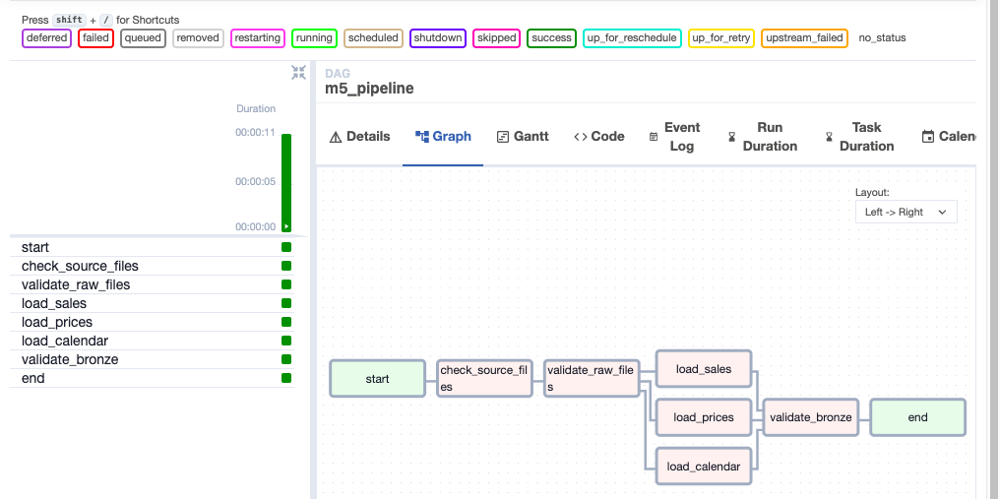

# Walmart M5 Forecasting

Retail demand forecasting / data engineering project using the Kaggle [M5 Forecasting - Accuracy](https://www.kaggle.com/competitions/m5-forecasting-accuracy) dataset.

## Project structure

```text
walmart-m5/
├── data/
│   ├── raw/                 # original Kaggle CSVs (gitignored)
│   ├── gold_export/         # local Parquet for Power BI (gitignored)
│   └── ingestion/           # manifests + bronze staging markers
├── airflow/
│   ├── docker-compose.yml
│   ├── dags/m5_pipeline_dag.py
│   ├── logs/
│   └── plugins/
├── src/
│   ├── ingestion/           # Python ingestion + Airflow tasks
│   ├── validation/
│   ├── transformations/
│   └── utils/
├── notebooks/
├── powerbi/                 # DAX + dashboard build docs
├── reports/                 # HTML progress reports + live Power BI embed
├── requirements.txt
└── README.md
```

## `m5_pipeline` DAG

```text
start
  → check_source_files
  → validate_raw_files
  → run_databricks_medallion      # Databricks Job 01→07
  → record_databricks_success
  → end
```

```mermaid
flowchart LR
  start --> check_source_files --> validate_raw_files
  validate_raw_files --> run_databricks_medallion
  run_databricks_medallion --> record_databricks_success --> end
```

Defined in [`airflow/dags/m5_pipeline_dag.py`](airflow/dags/m5_pipeline_dag.py).

Earlier local staging graph (before Databricks wiring):



## Prerequisites

- Docker Desktop installed and running
- Raw M5 files in `data/raw/`:
  - `calendar.csv`
  - `sales_train_evaluation.csv`
  - `sell_prices.csv`

## Download the dataset

1. Create a Kaggle account and join the [m5-forecasting-accuracy](https://www.kaggle.com/competitions/m5-forecasting-accuracy) competition.
2. Authenticate the Kaggle CLI, then download:

```bash
kaggle competitions download -c m5-forecasting-accuracy
unzip m5-forecasting-accuracy.zip -d data/raw
```

## Stage 1 — Python ingestion (optional standalone)

```bash
python src/ingestion/run_ingestion.py
```

Writes:

- `data/ingestion/manifests/<batch_id>.json`
- `data/ingestion/manifests/latest.json`

## Stage 2 — Run Airflow with Docker

### 1. Start the stack

```bash
cd airflow
docker compose up -d
```

Wait until containers are healthy:

```bash
docker compose ps
```

You should see `postgres`, `airflow-webserver`, and `airflow-scheduler` running.

### 2. Open the Airflow UI

Open: **http://localhost:8088**

| Field | Value |
|---|---|
| Username | `airflow` |
| Password | `airflow` |

> Port **8088** is used because **8080** may already be taken on some machines.

### 3. Run the DAG

1. In the DAG list, find **`m5_pipeline`**
2. Toggle it **On** (unpause)
3. Click the play button → **Trigger DAG**
4. Open the run → **Graph** tab

Successful run in the Airflow UI (**Graph** tab):


See the full DAG diagram in the [m5_pipeline DAG](#m5_pipeline-dag) section above.

### 4. Useful commands

```bash
cd airflow

# status
docker compose ps

# follow logs
docker compose logs -f airflow-scheduler
docker compose logs -f airflow-webserver

# stop everything
docker compose down

# stop and remove the Postgres volume (full reset)
docker compose down -v
```

### 5. First-time notes

- First `docker compose up -d` downloads images and can take several minutes.
- DAG files live in `airflow/dags/` and are mounted into the containers.
- Project code (`src/`) and data (`data/`) are mounted at `/opt/airflow/project`.

## Stage 3 — Airflow → Databricks Jobs

Automate Bronze→Silver→Gold by triggering one Databricks multi-task job.

### 1. Create Databricks token + job

1. Databricks → Settings → Developer → **Access token**
2. Jobs & Pipelines → Create job **`walmart_m5_medallion`**
3. Add notebook tasks `01`→`07` with dependencies (see `airflow/databricks/walmart_m5_medallion_job.json`)
4. Copy the numeric **Job ID**

### 2. Configure `airflow/.env`

```bash
cd airflow
cp .env.example .env
```

Set:

- `DATABRICKS_HOST`
- `DATABRICKS_TOKEN`
- `WALMART_M5_DATABRICKS_JOB_ID`
- `AIRFLOW_CONN_DATABRICKS_DEFAULT` (JSON with host + token password)

### 3. Rebuild Airflow (Databricks provider image)

```bash
cd airflow
docker compose build
docker compose up -d
```

Trigger **`m5_pipeline`**. Detail guide: [`reports/07-airflow-databricks-jobs.html`](reports/07-airflow-databricks-jobs.html).

## Stage 4 — Power BI live dashboard

Published report (**walmart_visualization**): Executive · Store · Product · Demand pages on Gold aggregates.

**Open live:** [Power BI view](https://app.powerbi.com/view?r=eyJrIjoiODI4NmU2YTYtZDBiMC00ZjM4LTkxMzgtNWMyOTlhZjc5OWNjIiwidCI6ImJlOTdiY2NhLWEzZTItNDc4Yy1iMWM1LWQ5YTRkMWI2NTY3YyJ9)

Embed:

```html
<iframe
  title="walmart_visualization"
  width="1024"
  height="1060"
  src="https://app.powerbi.com/view?r=eyJrIjoiODI4NmU2YTYtZDBiMC00ZjM4LTkxMzgtNWMyOTlhZjc5OWNjIiwidCI6ImJlOTdiY2NhLWEzZTItNDc4Yy1iMWM1LWQ5YTRkMWI2NTY3YyJ9"
  frameborder="0"
  allowFullScreen="true"
></iframe>
```

Also embedded on [`reports/index.html`](reports/index.html). Analysis write-ups: `reports/08`–`11`.

## Progress reports

Open in a browser:

- [`reports/index.html`](reports/index.html) — overview + **live Power BI embed**
- [`reports/01-raw-dataset.html`](reports/01-raw-dataset.html) — Step 1 Raw
- [`reports/02-python-ingestion.html`](reports/02-python-ingestion.html) — Step 2 Python ingestion
- [`reports/03-airflow.html`](reports/03-airflow.html) — Step 3 Airflow
- [`reports/04-databricks-bronze.html`](reports/04-databricks-bronze.html) — Step 4 Bronze
- [`reports/05-databricks-silver.html`](reports/05-databricks-silver.html) — Step 5 Silver
- [`reports/06-databricks-gold.html`](reports/06-databricks-gold.html) — Step 6 Gold
- [`reports/07-airflow-databricks-jobs.html`](reports/07-airflow-databricks-jobs.html) — Step 7 Airflow → Jobs
- [`reports/08-executive-dashboard-analysis.html`](reports/08-executive-dashboard-analysis.html) — Dashboard 1 Executive
- [`reports/09-store-dashboard-analysis.html`](reports/09-store-dashboard-analysis.html) — Dashboard 2 Store
- [`reports/10-product-dashboard-analysis.html`](reports/10-product-dashboard-analysis.html) — Dashboard 3 Product
- [`reports/11-demand-dashboard-analysis.html`](reports/11-demand-dashboard-analysis.html) — Dashboard 4 Demand

## Databricks notebooks

Import these into Workspace folder `walmart_m5/notebooks` (Databricks `.py` source format):

| Notebook | Purpose |
|---|---|
| [`notebooks/01_bronze_ingestion.py`](notebooks/01_bronze_ingestion.py) | Raw Volume → Bronze Delta |
| [`notebooks/02_silver_sales.py`](notebooks/02_silver_sales.py) | Wide → long sales + date map |
| [`notebooks/03_silver_products.py`](notebooks/03_silver_products.py) | Products, stores, prices |
| [`notebooks/04_silver_calendar.py`](notebooks/04_silver_calendar.py) | Clean calendar + SNAP/events |
| [`notebooks/05_gold_dimensions.py`](notebooks/05_gold_dimensions.py) | `dim_date`, `dim_product`, `dim_store` |
| [`notebooks/06_gold_facts.py`](notebooks/06_gold_facts.py) | `fact_daily_sales`, `fact_product_prices` |
| [`notebooks/07_gold_aggregations.py`](notebooks/07_gold_aggregations.py) | BI aggregate tables |

Run order: **01 → 02 → 03 → 04 → 05 → 06 → 07**.

Tips for Free Edition:
- Notebook 02: set `DAY_LIMIT = 28` for a quick test before full history
- Notebook 06: optionally set `START_DATE` / `END_DATE` before building full `fact_daily_sales`
